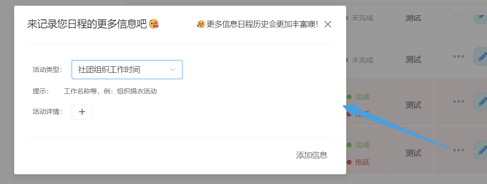

# SchedulePlan

### 应用介绍

#### 功能介绍

SchedulePlan的目的是提供一个便捷制定日程计划的系统。并且有别于普通的日程计划软件，系统提供不同数据展示功能，页面力求简洁美观，让日程计划记录易于查看。方便用户的日程计划制定的同时，让过程减少枯燥。同时系统也会在日程计划记录添加时收集更多字段信息。历史模块中收集用户的历史数据，统计且可视化展示用户时间管理记录。历史日程计划记录的收集，帮助用户省去了整理总结的时间，并且收到过去时间管理情况的反馈，以便对未来时间更好更有效的管理。系统不是简单的“闹钟”，而是一本“日记”。

1. 系统信息管理。主要包括用户账号管理、通知管理、更新日志管理、问题反馈管理、元数据管理。用户账号管理是为前台用户的登录注册；通知管理是对前台应用的通知面板进行维护；更新日志管理记录着前台应用迭代的过程；问题反馈保存着用户提供的应用不足处；元数据管理维护着前台应用系统可变的通用基础数据。
2. 日程。主要包括日程记录管理、日程详情管理、日程卡管理、视图切换。日程记录管理前台用户可以添加并维护日程记录；日程详情可以为日程记录填写其他信息作为历史模块的分析数据；日程卡管理让前台用户可以对日程卡进行自我评定；视图切换允许前台用户用不同视图查看日程记录。
3. 计划。主要包括模板管理、记录填写、视图切换。模板管理允许前台用户创建自定义模板；前台用户可以在自定义模板上填写记录；计划清单可以进行视图切换查看。
4. 历史。主要包括基础信息统计，作息时间统计，记录分类统计。基础信息统计统计了用户日程记录的一些信息；作息时间统计统计用户拥有起床和睡觉时间的记录；记录分类统计将所有的日程记录按主题的类别统计。

### 软件介绍

#### 技术栈

日程计划系统是基于B/S架构的web应用程序，有前后台项目。前端采用基于Vue.js的vue生态圈技术构建，并使用了navie-ui UI框架。后端代码使用了面向对象的编程语言Java，并使用了Spring Boot框架搭建。后端服务模块化开发，并将前后台部分基础业务拆分出来，利用zookeeper、dubbo等技术进行服务间的联调。项目采用前后端分离思想，定义前后端传输协议。前端采用axios技术，使用RESTful风格的http请求调用后端接口。数据库使用MySQL数据库，web服务器为Tomcat。

1. 前端技术栈：Vue.js、axios、vite、echarts、vue-router、pinia。
2. 后端技术栈：SpringBoot、SpringMVC、Sprinb Security、Dubbo、Zookeeper、MyBatis Plus。

#### 应用组成

项目目录介绍：

1. `sp-front-end`：前台前端项目。
2. `sp-front-end-manage`：后台后端项目。
3. `sp`：后端微服务项目，有基础服务，前台后端服务，后台后端服务。

软件结构图：

#### 模板视图实现

项目希望实现类似多维表格不同维度查看数据，提供给数据不同视图的功能。而分析型数据库中的多维模型提供了这样一个途径。多维模型有适应历史数据的模型，如CUBE模型，也有面对增量数据场景下的模型，如星型模型。CUBE模型，将数据整合成一个多维数组，由于固定结构，新增数据都需要重新计算它的结构。而星型模型以事实表为基础，以多个维度表提供多维度查看数据。星型表的思路是为记录提供索引，此索引通过关系进行维护，适合关系型数据库，也能应对数据增加的情况，本次项目便是采用这个思路。

对于多维表格来说，达到不同视图的展示，需要表字段额外信息帮助。二维表由行列组成，行对象存储数据，而列对象组成了表结构的定义。学生按照这样的思路抽象出了三个对象，通过对字段对象的属性自定义，便可以让项目实现二维表的不同视图展示的能力。同时上文思路中的维度表信息可以存放字段属性中。

#### 数据库关系图

### 页面展示

#### 登陆注册

#### 前台主页

#### 个人信息

#### 页脚及其相关功能

#### 日程模块

##### 打开日程卡

##### 切换视图

##### 日程管理

##### 其他

#### 计划模块

##### 查看模版

##### 添加模板

##### 模板操作

#### 历史模块

#### 后台主页

#### 因素库

